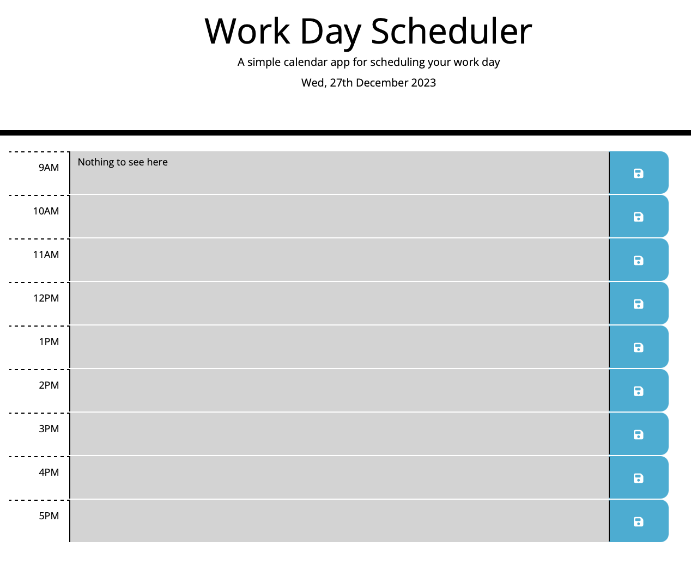

# Day Planner with Local Storage

## Description 

This is a simple Day Planner that allows you to type in your schedule for the day in each text field. The blue buttons allow you to save the schedule for that row to local storage so it will load the next time you open the app. An added feature is the coloring of the rows. If the row is Grey it means the current time is past this rows time. If the colour is Red that means this rows time represents the current time. If it is Green then it is in the future. 

## Usage 

Click in the text fields to type your task for that hour. Click the blue save button next to that row to save the data. To clear the data simply delete the text and click save again. The rows will be colour coded depending on the current time of day (see description for details).

## License

See the licence section in the repo.

## Badges

## Tech
- JavaScript 
- jQuery
- Day.js
- HTML
- CSS
